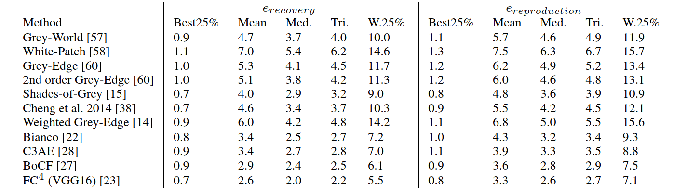

# Description
This repository provides the official implimentation of the illuminant estimation algorithm **BoCF** proposed in paper *[Bag of Color Features For Color Constancy](https://ieeexplore.ieee.org/document/9130881)*  using *[INTEL-TAU dataset](https://ieeexplore.ieee.org/document/9371681)*. 

# BoCF
In this paper, we propose a novel color constancy approach, called **BoCF**, building upon Bag-of-Features pooling. The proposed method substantially reduces the number of parameters needed for illumination estimation. At the same time, the proposed method is consistent  with the color constancy assumption stating that global spatial information is not relevant for illumination estimation and local information (edges, etc.) is sufficient. Furthermore, **BoCF** is consistent with color constancy statistical approaches and can be interpreted as a learning-based generalization of many statistical approaches.

**BoCF** consists of three main blocks: feature extraction block, Bag of Features block, and an estimation block. In the first block, regular convolutional layers are used to extract relevant features. Inspired by the assumption that second order gradient information is sufficient to extract the illumination information, we use only two convolutional layers to extract the features.  In the second block, i.e., the Bag of Features block, the network learns the *[dictionary](https://arxiv.org/abs/1707.08105)* over the non-linear transformation provided by the first block. This block outputs a histogram representation, which is fed to the last component, i.e., the estimation block, to regress to the scene illumination. 

<p align="center">
  
</p>

 To further improve the illumination estimation accuracy, we propose a novel attention mechanism for the **BoCF** model with two variants based on self-attention. In the first variant (Attention1), we add an attention mechanism between the feature extraction block and the Bag of Features block. This mechanism allows the network to dynamically select parts of the image to use for estimating the illumination, while discarding the remaining parts. Thus, the network becomes robust to noise and irrelevant features. In the second variant (Attention2), we add an attention mechanism on top of the histogram representation, i.e.,  between the Bag of Features block and the estimation block. In this way, we allow the network to learn to adaptively select the elements of the histogram which best encode the illuminant information. The model looks over the whole histogram after the spatial information has been discarded and generates a proper representation according the current context (histogram).

<p align="center">
  
</p>


# Usage

### INTEL-TAU Dataset
*[INTEL-TAU dataset](https://ieeexplore.ieee.org/document/9371681)* is the largest *[publicly available](http://urn.fi/urn:nbn:fi:att:f8b62270-d471-4036-b427-f21bce32b965)*  illumination estimation dataset. It is composed of 7022 scenes in total. The variety of scenes captured using three different camera models, i.e., Canon 5DSR, Nikon D810, and Sony IMX135, makes the dataset appropriate for evaluating the camera and scene invariance of the different illumination estimation techniques. 

### Dependencies 

The project was tested in Python 3. Run `pip install -r requirements.txt` to install dependent packages.

### Using our codes.
**1/** Download the preprossed 1080p TIFF variant of the dataset. 

**2/** Set the root path variable in main_BoCF.py to your data path, e.g., 'root_path': '/mnt/Data/Firas2/Intel_v3/processed_1080p' 

**3/** Run the script  main_BoCF.py : python3 main_BoCF.py 

### Walking through the main code (main_BoCF.py): 

**1/** First a dataset class is created using the paramters 

    inteltau = INTEL_TAU_DATASET(**dataset_params)
    inteltau.set_subsets_splits()

**2/** For each fold, we generate the split using the configuration file:

    partition,ground_truths = inteltau.get_train__test_10folds(fold)            

**3/** We augment the training and validation data relative to the current fold and save the augmented dataset relative to the fild in the aug_path. 
Note1:  This step is only excuted in case the augmented dataset folder does not exist.
Note2: Don't stop the code in the middle of this step. In case the code was stopped before this step is finished, the aug_path folder needs to be deleted manually. 

    augment_data(15*len(partition['train']),partition['train'],ground_truths['train'],(227,227),train_dir)    
    augment_data(5*len(partition['validation']),partition['validation'],ground_truths['validation'],(227,227),val_dir)  

**4/** We create a BoCF model. There are two hyper-parameters: histogram_size (default=150) and attention_variant (default=2). If attention_variant needs to be changed to 1 to use attention1 variant or 0 to test the standard approach without attention. 
    
     model = BoCF(n_codewords = hist_size , show_summary= True,attention =attention_variant) 

**5/** Training the model and testing it using the test set

     history = model.fit_generator(generator=training_generator, epochs=EPOCHS,
                            validation_data=validation_generator,
                            steps_per_epoch = (len(partition['train']) // train_params['batch_size']) ,                    
                            use_multiprocessing=True, 
                            callbacks =all_callbacks( path + '.hdf5' ),
                            workers=4)
     test_model(model,partition['test'],ground_truths['test'],method,path,result_path)

# Results


<p align="center">
  
</p>


# Cite This Work

```
@article{laakom2020bag,
  title={Bag of color features for color constancy},
  author={Laakom, Firas and Passalis, Nikolaos and Raitoharju, Jenni and Nikkanen, Jarno and Tefas, Anastasios and Iosifidis, Alexandros and Gabbouj, Moncef},
  journal={IEEE Transactions on Image Processing},
  volume={29},
  pages={7722--7734},
  year={2020},
  publisher={IEEE}
}

@article{laakom2021intel,
  title={Intel-tau: A color constancy dataset},
  author={Laakom, Firas and Raitoharju, Jenni and Nikkanen, Jarno and Iosifidis, Alexandros and Gabbouj, Moncef},
  journal={IEEE Access},
  volume={9},
  pages={39560--39567},
  year={2021},
  publisher={IEEE}
}
```
