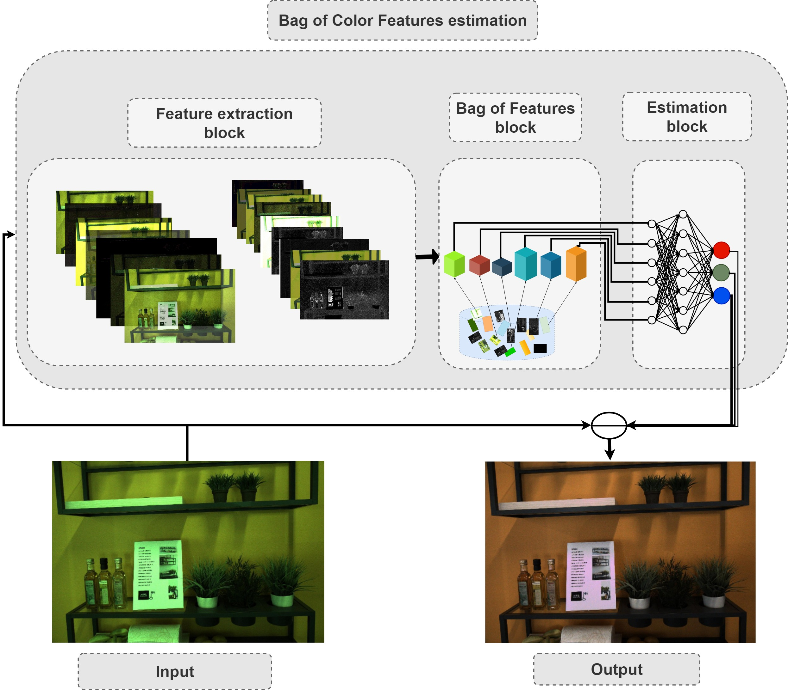
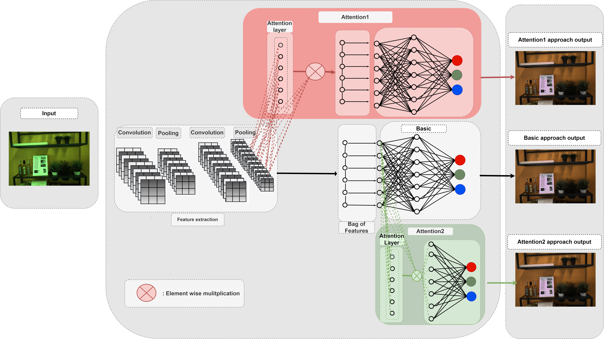

# BoCF
This repository provides the official implimentation of the illuminant estimation algorithm **BoCF** proposed in paper *[Bag of Color Features For Color Constancy](https://ieeexplore.ieee.org/document/9130881)*  using *[INTEL-TAU dataset](http://urn.fi/urn:nbn:fi:att:f8b62270-d471-4036-b427-f21bce32b965)*. 

# Introduction
In this paper, we propose a novel color constancy approach, called **BoCF**, building upon Bag-of-Features pooling. The proposed method substantially reduces the number of parameters needed for illumination estimation. At the same time, the proposed method is consistent  with the color constancy assumption stating that global spatial information is not relevant for illumination estimation and local information (edges, etc.) is sufficient. Furthermore, **BoCF** is consistent with color constancy statistical approaches and can be interpreted as a learning-based generalization of many statistical approaches.

**BoCF** consists of three main blocks: feature extraction block, Bag of Features block, and an estimation block. In the first block, regular convolutional layers are used to extract relevant features. Inspired by the assumption that second order gradient information is sufficient to extract the illumination information, we use only two convolutional layers to extract the features.  In the second block, i.e., the Bag of Features block, the network learns the *[dictionary](https://arxiv.org/abs/1707.08105)* over the non-linear transformation provided by the first block. This block outputs a histogram representation, which is fed to the last component, i.e., the estimation block, to regress to the scene illumination. 

  

 To further improve the illumination estimation accuracy, we propose a novel attention mechanism for the **BoCF** model with two variants based on self-attention. In the first variant, we add an attention mechanism between the feature extraction block and the Bag of Features block. This mechanism allows the network to dynamically select parts of the image to use for estimating the illumination, while discarding the remaining parts. Thus, the network becomes robust to noise and irrelevant features. In the second variant, we add an attention mechanism on top of the histogram representation, i.e.,  between the Bag of Features block and the estimation block. In this way, we allow the network to learn to adaptively select the elements of the histogram which best encode the illuminant information. The model looks over the whole histogram after the spatial information has been discarded and generates a proper representation according the current context (histogram).

  

